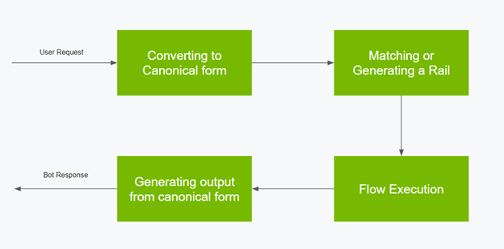
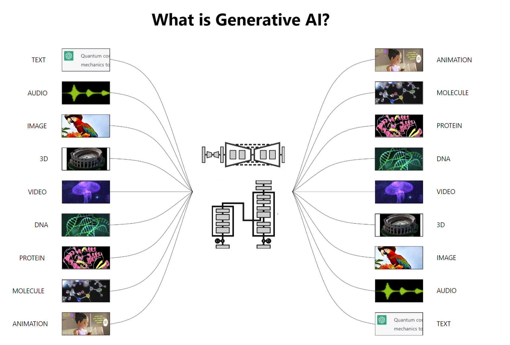
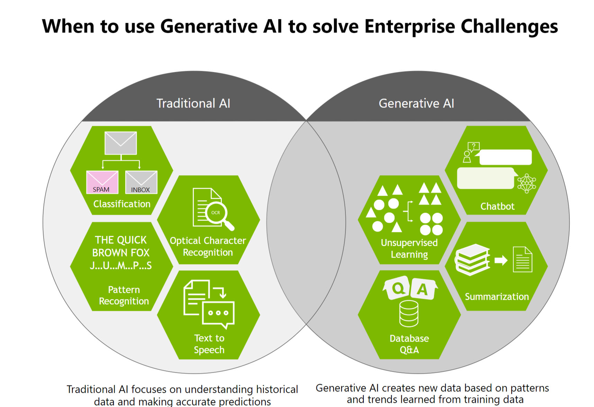
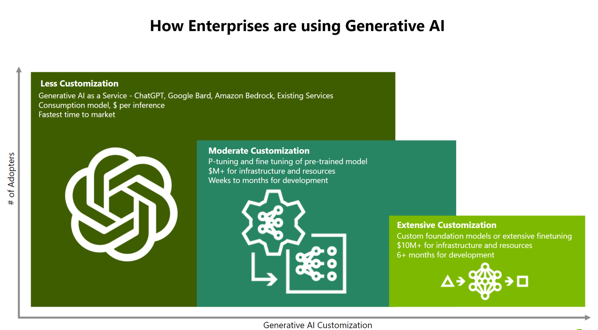

## Introduction

Large language models (LLMs) are incredibly powerful and capable of answering complex questions, performing feats of creative writing, developing, debugging source code, and so much more. You can build incredibly sophisticated LLM applications. Yet, building these LLM applications in a safe and secure manner is challenging.

From NVIDIA presentation

Gen AI use neural networks to identify patterns and strucutres within data to generate new content

