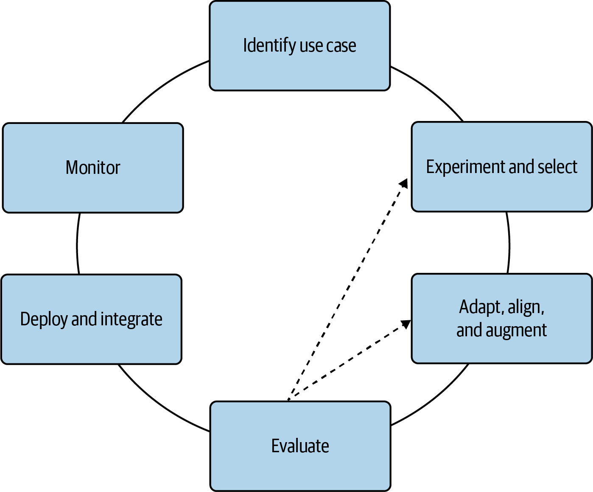

Use Cases

- Intelligent Search
- Text summarization
- Rewriting
- Information extraction
- Question answering
- Detecting toxic or harmful content
- Calssification and content moderation
- Conversational interface
- Translation
- - Automated customer-support chatbot
- Dialog Summarization
- Content Moderation
- Personalized Product Videos
- Source Code Generation
- Reasoning
- Mask personally identifiable information
- Personalized marketing and ads
- 

- Identify use case: First define your scope, including the specific generative use case and task that you plan to address with your generative AI application. 
- Experiment and select: Start with an existing, well-documented, relatively small foundation model to iterate quickly and learn the unique ways of interacting with these generative AI models with a relatively small amount of hardware. 
  - Start with a playground environment such as:
  - Amazon SageMaker JumpStart or Amazon Bedrock
  - Google Vertex
  - Azure . This lets you try different prompts and models quickly, as you will see in Chapter 2. Next, you might use a Jupyter notebook or Python script using an integrated development environment (IDE) like Visual Studio Code (VS Code) or Amazon SageMaker Studio notebooks to prepare your custom datasets to use when experimenting with these generative models. Once you are ready to scale your efforts to a larger distributed cluster, you would then migrate to SageMaker distributed training jobs to scale to a larger compute cluster using accelerators like the NVIDIA GPU or AWS Trainium, as you will see in Chapter 4.

While you may be able to avoid accelerators initially, you will very likely need to use them for longer-term development and deployment of more complex models. The sooner you learn the unique—and sometimes obscure—aspects of developing with accelerators like NVIDIA GPUs or AWS Trainium chips, the better. Fortunately, a lot of the complexity has been abstracted by the hardware provider through the NVIDIA CUDA library and AWS Neuron SDK, respectively.

Adapt, align, and augment.
It’s important to adapt generative models to your specific domain, use case, and task. Chapters 5, 6, 7, and 11 are dedicated to fine-tuning your multimodal generative AI models with your custom datasets to meet your business goals.

Additionally, as these generative models become more and more humanlike, it is important that they align with human values and preferences—and, in general, behave well. Chapters 7 and 11 explore a technique called reinforcement learning from human feedback (RLHF) to align your multimodal generative models to be more helpful, honest, and harmless (HHH). RLHF is a key component of the much-broader field of responsible AI.

While generative models contain an enormous amount of information and knowledge, they often need to be augmented with current news or proprietary data for your business. In Chapter 9, you will explore ways to augment your generative models with external data sources or APIs.

Evaluate.
To properly implement generative AI applications, you need to iterate heavily. Therefore, it’s important to establish well-defined evaluation metrics and benchmarks to help measure the effectiveness of fine-tuning. You will learn about model evaluation in Chapter 5. While not as straightforward as traditional machine learning, model evaluation helps measure improvements to your models during the adaptation and alignment phase—specifically, how well the model aligns to your business goals and human preferences.

Deploy and integrate.
When you finally have a well-tuned and aligned generative model, it’s time to deploy your model for inference and integrate the model into your application. In Chapter 8, you will see how to optimize the model for inference and better utilize your compute resources, reduce inference latency, and delight your users.

You will also see how to deploy your models with the AWS Inferentia family of compute instances optimized for generative inference using Amazon SageMaker endpoints. SageMaker endpoints are a great option for serving generative models as they are highly scalable, fault tolerant, and customizable. They offer flexible deployment and scaling options like A/B testing, shadow deployments, and autoscaling, as you will learn in Chapter 8.

Monitor.
As with any production system, you should set up proper metrics collection and monitoring systems for all components of your generative AI application. In Chapters 8 and 12, you will learn how to utilize Amazon CloudWatch and CloudTrail to monitor your generative AI applications running on AWS. These services are highly customizable, accessible from the AWS console or AWS software development kit (SDK), and integrated with every AWS service including Amazon Bedrock, a managed service for generative AI, which you will explore in Chapter 12.