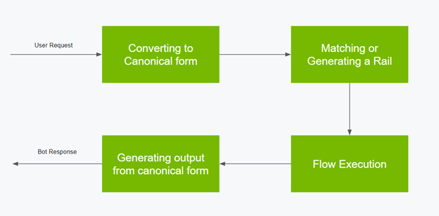

## AI ChatBots

## What is Required

A good chatbot should be:

* Trustworthy/Honest
* Helpful
* Humble
* Safe & Reliable
* Secure

It also helpds if it:

* Personalized
* Fast
* Inexpensive
* Powerful (multiple capbilities, reasoning)
* Easy to use (multi-modal)

Not clear if I can use this diagram

from https://cloud.google.com/vertex-ai/docs/generative-ai/learn/overview

* Prompt 
* Response
* Safety & Responsibility Module
* Foundation Models
* Grounding Service
* Citaiton Check
* 

### Guardrails

#### NEMO GuardRails

https://developer.nvidia.com/blog/nvidia-enables-trustworthy-safe-and-secure-large-language-model-conversational-systems/?ncid=prsy-552511#cid=dl28_prsy_en-us

NeMo Guardrails is an open-source toolkit from NVIDIA for easily developing safe and trustworthy LLM conversational systems. 

Guardrails are a set of programmable constraints or rules that sit in between a user and an LLM. These guardrails monitor, affect, and dictate a user’s interactions.

https://developer-blogs.nvidia.com/wp-content/uploads/2023/04/Figure-1-Process-flow-of-a-user-interaction-with-NeMo-Guardrails.png

