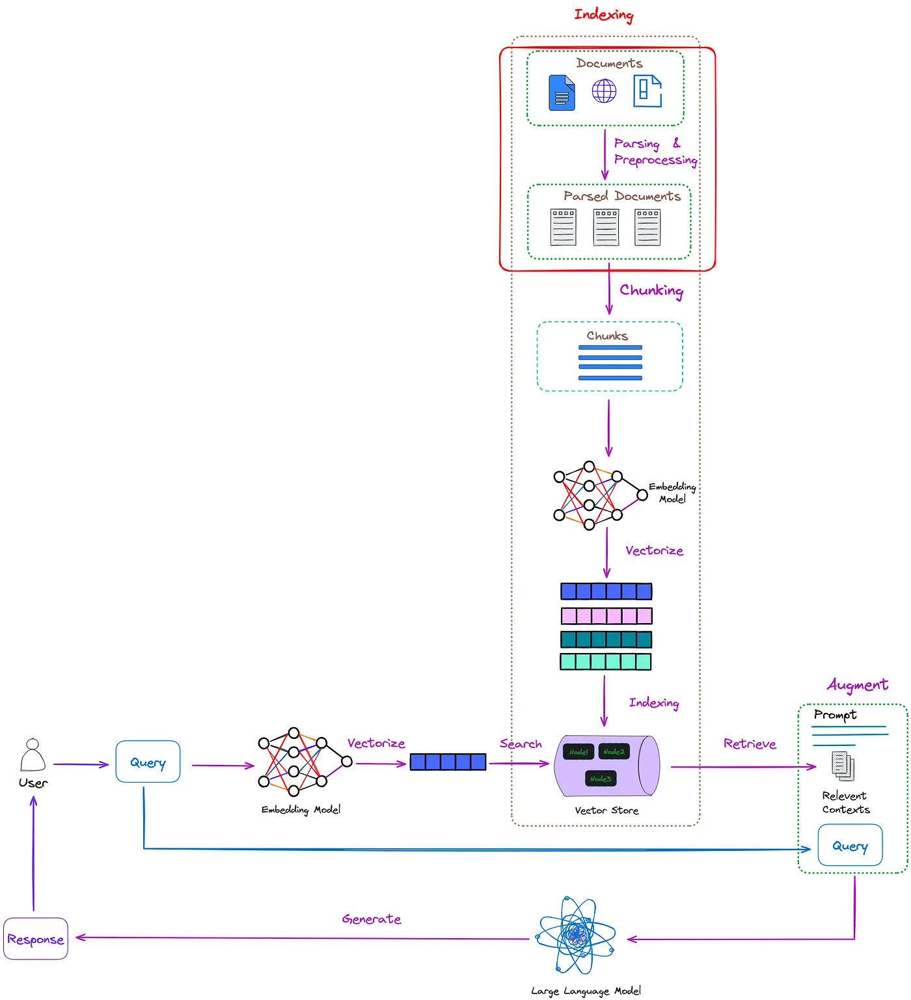
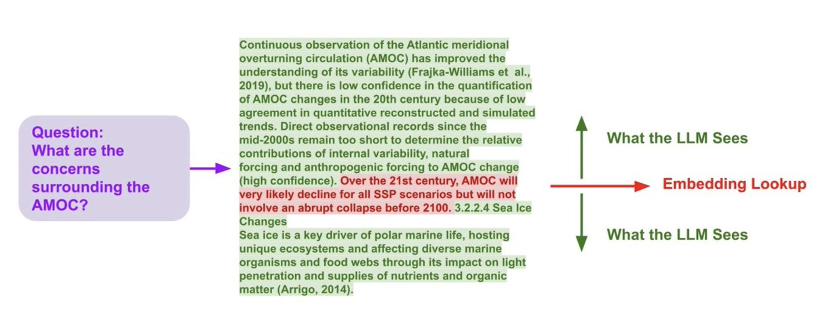

## RAG

## RAG Overview

RAG logically can be divided into

- Ingestion Service
- Inference Service
- Vector Database
- User or API server

### The RAG Pipeline

### Some RAG Concepts

* Small to Big Retrieval 
#### Small to Big Retrieval 

Description:
* Chunk your documents into small chunks (ie 'sentences.')
  * Small chunks lead to vectors with ...
* Find the closest vector to your query
* Retrieve the selected node and surrounding context 
When you look up the sentences
  See https://docs.llamaindex.ai/en/latest/examples/node_postprocessor/MetadataReplacementDemo.html
* 

### RAG Example 1

### RAG Example 2

### RAG Example 3

### RAG Example 4

### RAG Example 5

### RAG Example 6 

SentenceWindowNodeParser

### RAG Example 7

### RAG FAQ

Some Questions & Answers about RAG